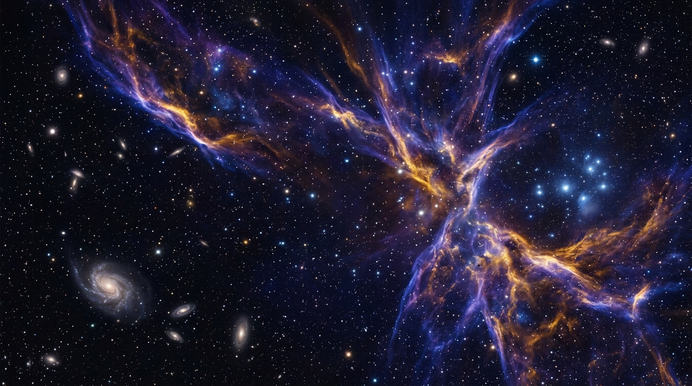

# 🌌 The Grand Chronicle of Earth & Life

An interactive, scientifically rigorous, deep-time simulator traversing **13.8 billion years** from the Big Bang to modern human civilization.



## ✨ Core Features

### 1. 🪐 4 Interactive Geological & Biological Epochs
- **Cosmic Dawn (13.8 Ga)**: Interactive Big Bang accretion & stellar nucleosynthesis simulator.
- **Prebiotic Earth (3.8 Ga)**: Hydrothermal vent abiogenesis & primordial ocean amino acid synthesis.
- **Age of the Dinosaurs (252 – 66 Ma)**:
  - Procedural kinematic dinosaur animations (*T-Rex, Brachiosaurus, Triceratops, Pteranodon*).
  - Living ecosystem behaviors: Territorial Roar, Hunting Sprint, Grazing, Day/Sunset/Night lighting.
  - Chicxulub bolide 10km asteroid impact physics & subterranean mammal burrow survival lab.
  - Pure procedural environmental backgrounds (no static creature photos).
- **Human Evolution (7.0 Ma – Present)**:
  - Full-body procedural anatomical morphing through 6 evolutionary stages.
  - Animated living habits: Bipedal walk/run, foraging & meat roasting, shelter dwellings, and flint knapping tool crafting with sparks.
  - Historical clothing progression (*natural fur ➔ pelt loincloth ➔ Ice Age fur parka ➔ tailored Upper Paleolithic sewn tunics*).
  - Dynamic **Evolutionary Trajectory Arrows** showing anatomical shifts (*cranial expansion, flat orthognathic face, valgus knee, spinal lordosis, foot arches*).

### 2. 🎵 Procedural 432 Hz Calming Ambient Soundscapes
- Built-in Web Audio API generative music synthesizer.
- **Themes**: *The Grand Chronicle (Home Symphony)*, *Calming Zen & Ocean Breath (432 Hz)*, *Cosmic Odyssey*, *Primordial Deep*, and *Mesozoic Dawn*.
- Real-time animated waveform frequency equalizer.

### 3. 🎓 Gamification & Pedagogy
- **Chronos AI Time Guide**: Interactive evolutionary scholar.
- **Section Examinations**: 5-question multi-topic astrophysics and paleontology quizzes.
- **Leaderboards & Badges**: Unlockable milestone achievements and XP leveling.
- **Offline PWA Support**: Local storage persistence and service worker readiness.

---

## 🚀 Quick Start

### Prerequisites
- [Node.js](https://nodejs.org/) (v18 or higher)
- [npm](https://www.npmjs.com/) or [bun](https://bun.sh/)

### Installation & Run

```bash
# Clone the repository
git clone https://github.com/<your-username>/grand-chronicle-earth-life.git
cd grand-chronicle-earth-life

# Install dependencies
npm install

# Run the development server
npm run dev
```

Visit `http://localhost:3000` to explore the chronicle!

---

## 🛠️ Tech Stack
- **Framework**: React 18 with TypeScript
- **Bundler**: Vite
- **Styling**: Tailwind CSS
- **Audio Engine**: Web Audio API Procedural Synthesizer
- **Icons**: Lucide React
- **Physics & Animation**: Canvas 2D Kinematics & Inverse Kinematics

---

## 📜 License
MIT License. Free for educational and non-commercial exploration.
